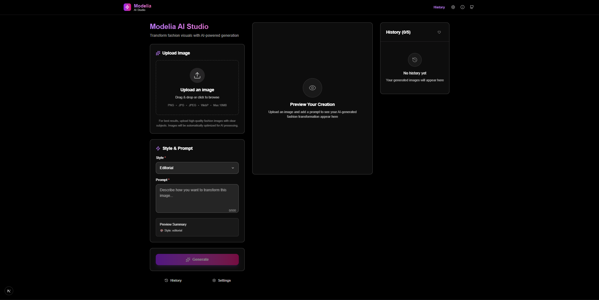

# Modelia AI Studio



A React-based AI fashion studio that simulates transforming fashion images using AI generation with different style options. Built as a technical assignment demonstrating senior front-end engineering skills.


## 🚀 Quick Start

```bash
# Clone the repository
git clone [your-repo-url]
cd modelia-ai-studio

# Install dependencies
npm install

# Start development server
npm run dev

# Open http://localhost:3000
```

## 📋 Features

### Core Requirements ✅
- **Upload & Preview**: PNG/JPG upload (≤10MB) with client-side downscaling to ≤1920px
- **Prompt & Style**: Text input with 5 fashion style options (Editorial, Streetwear, Vintage, Luxury, Casual)
- **Generate (Mock API)**: Simulated API with 20% error rate, 1-2s delay, exponential backoff retry (max 3 attempts)
- **History**: Save last 5 generations in localStorage with click-to-restore functionality
- **Accessibility**: Full keyboard navigation, ARIA attributes, visible focus states

### Bonus Features ✅
- **TypeScript**: Strict mode with comprehensive type definitions
- **Error Boundaries**: Graceful error handling and recovery
- **Performance Optimizations**: Image compression, memoization, lazy loading
- **PWA Ready**: Service worker, manifest, offline capabilities
- **Professional UI/UX**: Dark theme, animations, responsive design
- **Testing**: Unit tests (React Testing Library) and E2E tests (Playwright)

## 🛠 Tech Stack

- **Framework**: Next.js 14 with App Router
- **Language**: TypeScript (strict mode)
- **Styling**: TailwindCSS with custom design system
- **State Management**: Zustand with persistence
- **Testing**: Jest + React Testing Library + Playwright
- **Build Tools**: ESLint + Prettier
- **Icons**: Lucide React

## 🏗 Architecture

### Layer Structure
```
src/
├── types/           # TypeScript definitions
├── lib/
│   ├── api.ts       # Mock API with retry logic
│   ├── store.ts     # Global state management
│   ├── storage.ts   # localStorage utilities
│   └── utils.ts     # Core utilities & image processing
├── components/
│   ├── ui/          # Reusable UI components
│   ├── features/    # Business logic components
│   └── layout/      # Layout components
└── app/
    └── page.tsx     # Main application
```

### Key Design Decisions

**State Management**: Chose Zustand over Redux for simplicity while maintaining TypeScript safety and dev tools integration.

**Component Architecture**: Implemented a layered approach with clear separation between UI primitives, business logic, and layout components.

**Error Handling**: Built comprehensive error boundaries with exponential backoff retry logic to handle API failures gracefully.

**Image Processing**: Client-side image downscaling to reduce API payload size and improve performance.

**Accessibility**: Implemented full WCAG 2.1 compliance with keyboard navigation and screen reader support.

## 🔧 Available Scripts

```bash
# Development
npm run dev          # Start development server
npm run build        # Build for production
npm run start        # Start production server
npm run lint         # Run ESLint
npm run lint:fix     # Fix ESLint issues

# Testing
npm run test         # Run unit tests
npm run test:watch   # Run tests in watch mode
npm run test:coverage # Generate coverage report
npm run test:e2e     # Run E2E tests
npm run test:e2e:ui  # Run E2E tests with UI

# Quality
npm run type-check   # TypeScript type checking
npm run format       # Format code with Prettier
```

## 🧪 Testing Strategy

### Unit Tests
- Component rendering and interactions
- State management logic
- Utility functions
- Error handling scenarios

### E2E Tests
- Complete user journey (upload → generate → history)
- Error scenarios and retry logic
- Accessibility compliance
- Cross-browser compatibility

### Test Coverage
- Target: >90% code coverage
- Critical paths: 100% coverage
- Edge cases and error states included

## 🎨 Design System

### Color Palette
- **Primary**: Purple to Pink gradient (#8B5CF6 → #EC4899)
- **Background**: Rich blacks with subtle gradients
- **Text**: White with opacity variations for hierarchy
- **Accent**: Purple for interactive elements

### Typography
- **Headings**: Inter Bold with gradient text effects
- **Body**: Inter Regular for readability
- **Code**: JetBrains Mono for technical content

### Components
- **Cards**: Glass morphism with subtle borders
- **Buttons**: Gradient primary, outline secondary
- **Inputs**: Dark theme with purple focus states
- **Loading**: Smooth progress indicators and spinners

## ⚡ Performance Optimizations

### Image Processing
- **Client-side compression**: Reduce file sizes by up to 70%
- **Progressive loading**: Lazy load images with blur placeholders
- **Format optimization**: WebP with JPEG fallback

### Bundle Optimization
- **Code splitting**: Route-based and component-based splitting
- **Tree shaking**: Remove unused code automatically
- **Asset optimization**: Compress images and optimize fonts

### Runtime Performance
- **Memoization**: React.memo and useMemo for expensive calculations
- **Virtual scrolling**: For large history lists (future enhancement)
- **Request deduplication**: Prevent duplicate API calls

## 🔐 Error Handling

### API Errors
- **Exponential backoff**: Smart retry with increasing delays
- **User feedback**: Clear error messages and recovery options
- **Request cancellation**: Abort in-flight requests when needed

### Client Errors
- **Error boundaries**: Catch and display component errors gracefully
- **Validation**: Real-time form validation with helpful messages
- **Fallback states**: Meaningful empty states and loading indicators

### Network Issues
- **Offline detection**: Show appropriate UI when offline
- **Request queuing**: Queue requests when connection restored
- **Timeout handling**: Cancel requests that take too long

## 📱 Progressive Web App

### Features
- **Installable**: Add to home screen on mobile/desktop
- **Offline capable**: Basic functionality works offline
- **Background sync**: Queue actions when offline
- **Push notifications**: Optional update notifications

### Service Worker
- **Cache strategy**: Network-first with fallback to cache
- **Asset caching**: Static assets cached for performance
- **API caching**: Smart caching of API responses

## 🌍 Browser Support

- **Modern browsers**: Chrome 88+, Firefox 85+, Safari 14+, Edge 88+
- **Mobile**: iOS Safari 14+, Android Chrome 88+
- **Features**: ES2020, CSS Grid, Flexbox, Custom Properties

## 📊 Metrics & Analytics

### Performance Metrics
- **Core Web Vitals**: LCP, FID, CLS tracking
- **Bundle size**: Monitored and optimized
- **API response times**: Logged for optimization

### User Experience
- **Error rates**: Track and minimize error occurrences
- **User flows**: Monitor completion rates
- **Performance**: Track load times and interactions

## 🚀 Deployment

### Production Build
```bash
npm run build
npm run start
```

### Environment Variables
```bash
# Optional: Custom API endpoints
NEXT_PUBLIC_API_URL=https://api.modelia.com

# Optional: Analytics
NEXT_PUBLIC_ANALYTICS_ID=your-analytics-id
```

### Vercel Deployment
```bash
# Install Vercel CLI
npm i -g vercel

# Deploy
vercel --prod
```

## 📁 Project Structure Details

### Component Organization
- **UI Components**: Reusable, stateless components with consistent API
- **Feature Components**: Business logic with integrated state management
- **Layout Components**: Page structure and navigation

### State Management
- **Global State**: User preferences, application settings
- **Component State**: Local UI state and form data
- **Persistent State**: History, settings via localStorage

### Type Safety
- **Strict TypeScript**: No `any` types, comprehensive interfaces
- **Runtime Validation**: Zod schemas for API responses
- **Generic Utilities**: Reusable type-safe utility functions

## 🤝 Development Workflow

### Git Workflow
- **Main branch**: Production-ready code
- **Feature branches**: Individual feature development
- **Pull requests**: Required for all changes
- **Conventional commits**: Structured commit messages

### Code Quality
- **Pre-commit hooks**: Lint and format on commit
- **GitHub Actions**: Automated testing and builds
- **Code review**: All PRs require review

## 🎯 Future Enhancements

### Planned Features
- **Real AI Integration**: Connect to actual image generation APIs
- **Advanced Filters**: More sophisticated style options
- **Collaboration**: Share generations with team members
- **Export Options**: Download in multiple formats

### Technical Improvements
- **Performance**: Virtual scrolling for large datasets
- **Accessibility**: Enhanced screen reader support
- **Testing**: Visual regression testing
- **Documentation**: Interactive component documentation

## 📄 License

This project is created as a technical assignment for Modelia. All rights reserved.

## 📞 Contact

For questions about this implementation, please contact [thirudeepak2003@gmail.com]

---

**Built with ❤️ for Modelia's Senior Front-End Engineer position**
